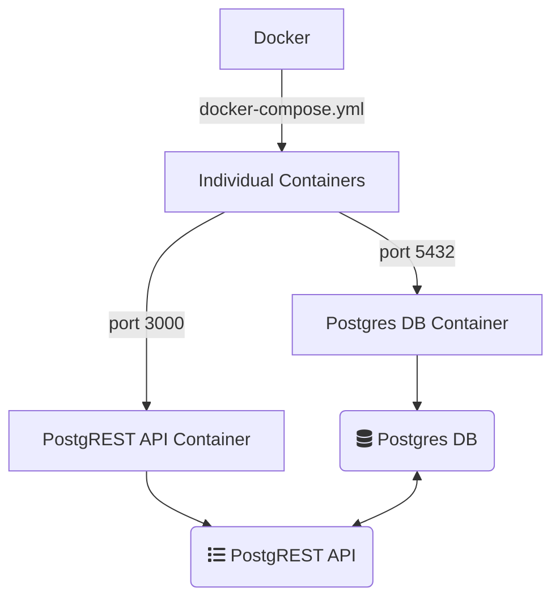

# Templates: Docker + Postgres
A template for spinning up a postgresql instance with an initialization script

## Structure

## Navigation

- PostgREST: [http://localhost:3000/](http://localhost:3000/)

## Running things

To stand up all images:

1. Ensure Docker Desktop is installed
1. Run command `docker compose up` from the root directory

If making changes to database initialization script:

1. Remove all volumes, images, and containers from docker
1. Run `docker compose down --volumes`

